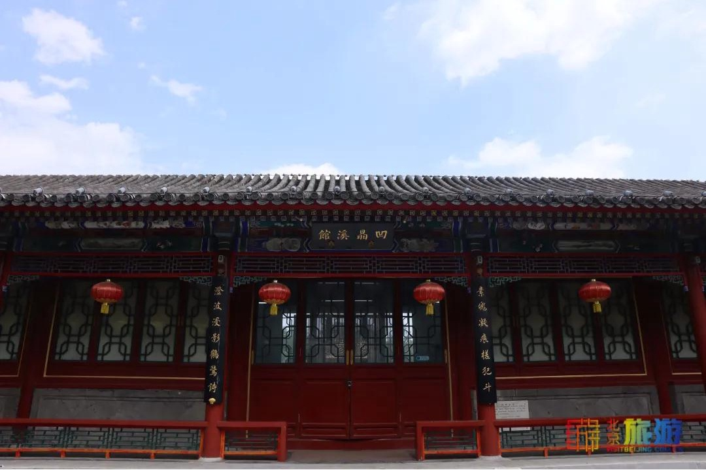

# Aojing Guan external references

Two of three required references are collected: the named windowed facade and a Shaw night-set lighting frame. The material close-view slot remains open.

**北京大观园里的凹晶溪馆**, Beijing Tourism / 北京旅游网, gallery published 2021-09-29. [Source and publisher copyright notice](https://s.visitbeijing.com.cn/gallery/17415). Individual photographer and capture date are not supplied. The publisher watermark and original image bytes are retained; no open reuse licence is asserted. This is a reference-only image, not a shipped game asset.

Direct original review shows the legible 凹晶溪館 plaque, a low broad gray-tiled roof, painted blue/green lintel members, red timber columns and paired closed doors with glazed geometric lattice panels. A low front rail and gray base are visible. Useful for Aojing frontage, roof, window-screen and threshold construction. The framing does not show the waterline, reflection, rear walls or full dry ledge; no measured seven-metre frontage or one-window night lighting is claimed.

The distinguishing material close-view slot remains uncollected. The night-set frame is recorded below. Saved source HTML and metadata preserve the exact source version used; the provider supplies no public content hash for comparison.

## Collected night-set lighting reference — 2026-10-08

**The Magic Blade**, frame at 5.0 seconds in the [Shaw Brothers Clips trailer](https://www.youtube.com/watch?v=FU-5zusTJSY), uploaded 20140703. The individual frame photographer and capture date are not supplied. This is copyrighted reference material; no open licence is asserted. It is outside shipped game assets.

A wet night lane has pale plaster walls, octagonal openings, puddle highlights, dark foreground cart/timber silhouettes and small warm lights at the distant gate. Blue/cool wall light and warm practicals separate materials without lighting the entire foreground. Night appearance is a visual inference from the dark exterior and visible lamps. This supplies the generic night-set lighting slot only: it is a street, not Aojing or a water-level reflection hall, and proves no pond waterline, dry ledge, facade dimensions or one-window placement. The low-resolution frame cannot establish fine plaster texture.

Original downloaded stream and exact extraction provenance are retained in [the shared trailer archive](../supporting/shaw-trailers/README.md). The 600 × 480 decoded frame retains publisher framing, bars and subtitles, with no crop, resize or added color grade. SHA-256: `dc42552a37d1db0d4cad9c1b6fd3d470983a4c28452d530999685ab647e1398e`.
