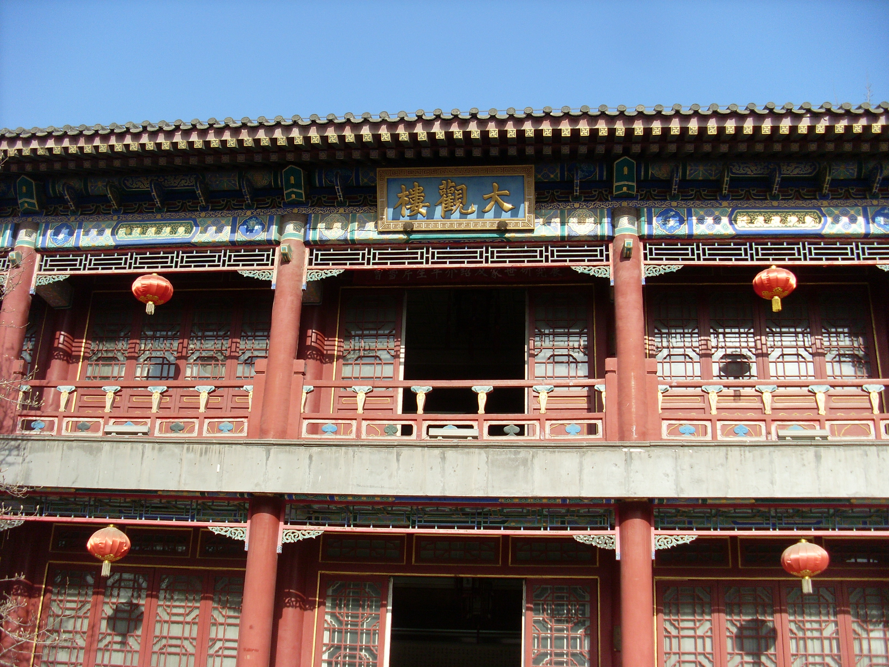

# Daguan Lou external references

All three required references are collected: site architecture, painted-wood details and a Shaw night-set lighting frame.

**Daguanlou, Daguanyuan**, 刻意, 20 December 2010. [Source and attribution](https://commons.wikimedia.org/wiki/File:Daguanlou,_Daguanyuan.jpg), [CC BY-SA 3.0](https://creativecommons.org/licenses/by-sa/3.0/). Unmodified original; bytes verified against the Commons SHA-1.

Two-storey ceremonial frontage, repeated red columns and lattice doors, balcony balustrade, shallow grey tiled eave, blue/green/gold brackets and an overhead hall plaque. Architecture reference only; not a night-lighting reference.

The architectural photograph fills slot 2; the close material view below fills slot 3. The Shaw Brothers night-set frame is recorded below.

## Collected painted-wood material reference — 2026-10-08

painted-wood-roof-detail.jpg — 朱華龍 - Zhu Hua Long, 2016-02-16 11:21. [Source](https://commons.wikimedia.org/wiki/File:%E5%A4%A7%E8%A7%82%E5%9B%AD_Beijing,_China_(26026061735).jpg), [photographer original](https://www.flickr.com/photos/mfaris01/26026061735/), [CC BY 2.0](https://creativecommons.org/licenses/by/2.0). Original bytes retained; SHA-256 `f155cc5b5667abf0e66d9cdf0b6fb58a91b745b156040ba209e751f7c2a99c07`.

The close upward view shows red lacquer posts and rails, blue/green/gold painted beams, exposed roof members, gray tile edges and carved bracket shapes. Paint wear exposes timber variation rather than a uniform flat surface. It supplies material separation and roof/beam detail for the imperial facade. No exact Daguan building identity, structural dimensions or night lighting are asserted.

Architecture, close material and sourced Shaw night-set slots are collected. Final scene art acceptance remains open.

## Collected night-set lighting reference — 2026-10-08

**The Enchanting Shadow**, frame at 17.0 seconds in the [Shaw Brothers Clips trailer](https://www.youtube.com/watch?v=oJ_Sy5j1XYU), uploaded 20121018. The individual frame photographer and capture date are not supplied. This is copyrighted reference material; no open licence is asserted. It is outside shipped game assets.

The court detail shows red posts, cream stone railing, a tiered gold ornament/table and localized warm candles against blue-lit foliage and dark structural recesses. The retained subtitle refers to midnight; the night treatment is also visible. It supplies a generic court night-set/material-separation reference, not Daguan identity, its full imperial facade, two-storey structure, roof geometry or surveyed proportions. The low-resolution source supports broad color and lighting hierarchy rather than fine painted-bracket or tile detail.

Original downloaded stream and exact extraction provenance are retained in [the shared trailer archive](../supporting/shaw-trailers/README.md). The 600 × 480 decoded frame retains publisher framing, bars and subtitles, with no crop, resize or added color grade. SHA-256: `4597c1d54ab33e526ac551acf920c5fc56ae7030edccddd27068e25e26d28053`.

The trailer labels the film 1959; the saved Hong Kong Film Archive record gives 1960. The discrepancy is recorded without treating the channel year as verified.
