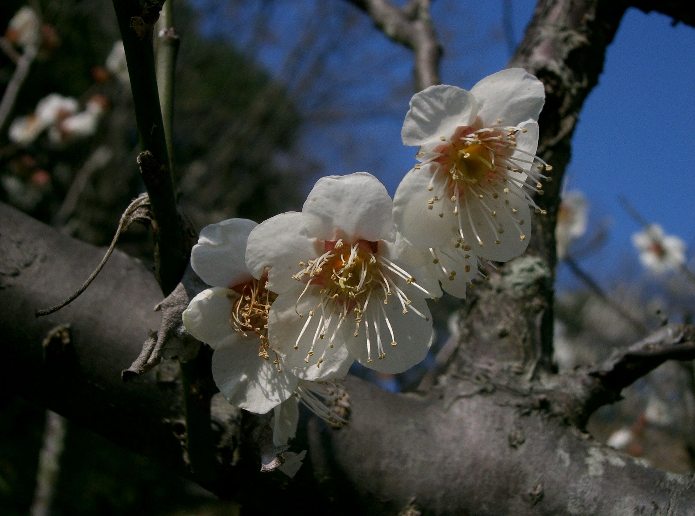
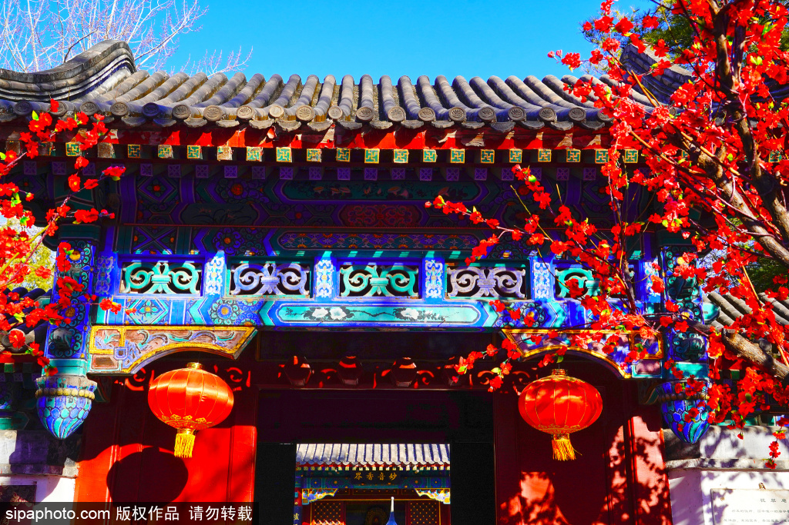

# Longcui An external references

Two of three required references are collected: the architecture and distinguishing foliage/material close views.

**Prunus mume Shirokaga1.jpg**, KENPEI, 2007-03-04. [Source and attribution](https://commons.wikimedia.org/wiki/File:Prunus_mume_Shirokaga1.jpg), [CC BY-SA 3.0](https://creativecommons.org/licenses/by-sa/3.0/). Unmodified original; bytes verified against the Commons SHA-1.

White five-petal plum flowers with rounded overlapping petals, dense pale stamens with yellow anthers, pink-red central cups, small buds and rough dark bark. Useful for blossom construction and sparse branch dressing; daylight color is not a night-lighting reference.

The plum close view does not establish entrance architecture or night lighting.

**大观园拢翠庵 领略古典建筑之美**, Sipa Photo image supplied by Beijing Tourism, published 2025-01-07. [Primary gallery and attribution](https://s.visitbeijing.com.cn/gallery/24573). The caption says January 3 without an explicit year; the individual photographer is not supplied. The copyrighted original retains its Sipa watermark. No open reuse licence is asserted; this is a reference, not a shipped game asset.

The directly reviewed frame shows a curved gray-tile entrance eave, round tile ends, painted blue/green/gold brackets and lintel, red posts, two red lanterns, blossom branches and whitewash. It identifies a gateway structure to compare with the current nunnery frontage. The entrance is open, and the frame excludes the lower gates and ground. It does not establish the specified dimensions, closed door leaves, walking surface, historical original or night lighting. Strongly saturated daylight colors are not the target garden grade.

The Shaw Brothers night-set slot remains uncollected. Saved source HTML and image metadata retain the attribution and original-byte hashes.
