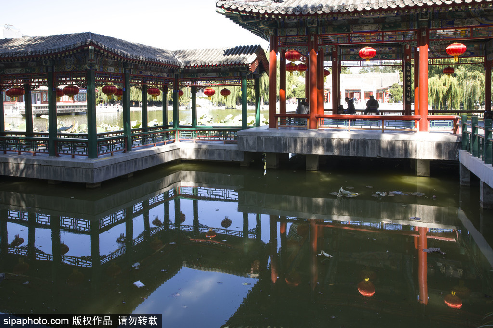

# Ouxiang Xie external references

All three required references are collected: architecture, the foliage/material close view and a Shaw night-set lighting frame.

**Lotus leaf and petal-2304-2.jpg**, Fg2, 2007. [Source and attribution](https://commons.wikimedia.org/wiki/File:Lotus_leaf_and_petal-2304-2.jpg), [Public domain](https://commons.wikimedia.org/wiki/Template:PD-self). Unmodified original; bytes verified against the Commons SHA-1.

A broad rounded lotus leaf with a gently undulating edge, radial veins, matte waxy surface and distinct water beads; a pale pink petal provides scale and color contrast. Useful for leaf/material detail, not architecture or night lighting.

The lotus image does not establish architecture or night lighting.

**北京大观园藕香榭**, Sipa Photo image supplied by Beijing Tourism, gallery published 2022-05-20. [Primary gallery and attribution](https://s.visitbeijing.com.cn/gallery/19014). The individual photographer and capture date are not supplied. This copyrighted image retains its Sipa watermark; no open reuse licence is asserted. It is a reference image, not a shipped game asset.

The directly inspected original shows open red-column pavilions above water, a connected covered gallery, geometric low rails, and gray raised platforms with visible supports. Gray tile ends, blue/green/gold beam painting and red hanging lanterns guide material separation. The gallery supplies the Ouxiang identification; the selected image itself has no readable building name. Exact dimensions, six-seat furniture, original historical construction and night lighting are not established.

The Shaw Brothers night-set frame is recorded below. Source HTML and image metadata retain the version and original-byte hashes used for this review.

## Collected night-set lighting reference — 2026-10-08

**The Enchanting Shadow**, frame at 15.0 seconds in the [Shaw Brothers Clips trailer](https://www.youtube.com/watch?v=oJ_Sy5j1XYU), uploaded 20121018. The individual frame photographer and capture date are not supplied. This is copyrighted reference material; no open licence is asserted. It is outside shipped game assets.

An open red-column pavilion has cream stone balustrades and a raised platform, a dark roof with gold beam details, a warm floor/column treatment and saturated blue foliage behind it. The table and open bays read against dark roof recesses. Night appearance is inferred from the dark exterior and cool/warm separation. This fills the generic night-set/built-structure lighting slot, not Ouxiang identity: water, support heights, exact dimensions, six seats and two lanterns are not established. Preserve warm wood, neutral stone and restrained blue background separation rather than reproducing the saturated source hue.

Original downloaded stream and exact extraction provenance are retained in [the shared trailer archive](../supporting/shaw-trailers/README.md). The 600 × 480 decoded frame retains publisher framing, bars and subtitles, with no crop, resize or added color grade. SHA-256: `ea70f2d3eb0361aa91aaa9f9faee290a42188b56df1afc2a7824216ca3ede235`.

The trailer labels the film 1959; the saved Hong Kong Film Archive record gives 1960. The discrepancy is recorded without treating the channel year as verified.
