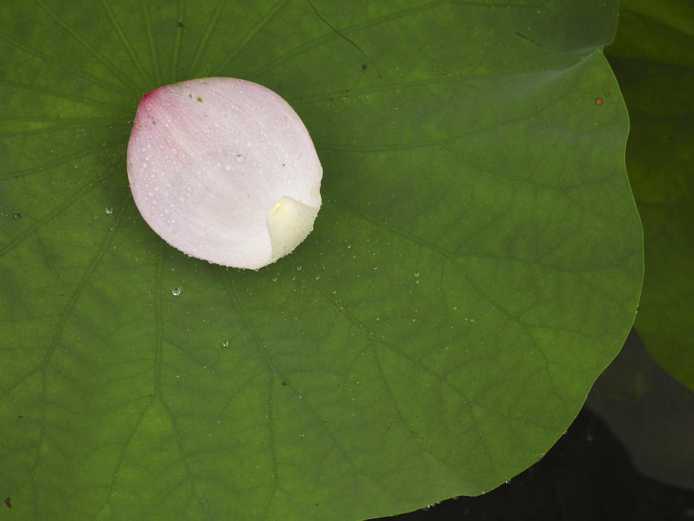

# Ouxiang Xie external references

One of three required references is collected: the distinguishing foliage/material close view.

**Lotus leaf and petal-2304-2.jpg**, Fg2, 2007. [Source and attribution](https://commons.wikimedia.org/wiki/File:Lotus_leaf_and_petal-2304-2.jpg), [Public domain](https://commons.wikimedia.org/wiki/Template:PD-self). Unmodified original; bytes verified against the Commons SHA-1.

A broad rounded lotus leaf with a gently undulating edge, radial veins, matte waxy surface and distinct water beads; a pale pink petal provides scale and color contrast. Useful for leaf/material detail, not architecture or night lighting.

The Shaw Brothers night-set still and site-specific architecture reference remain uncollected. This image does not fill those slots.
