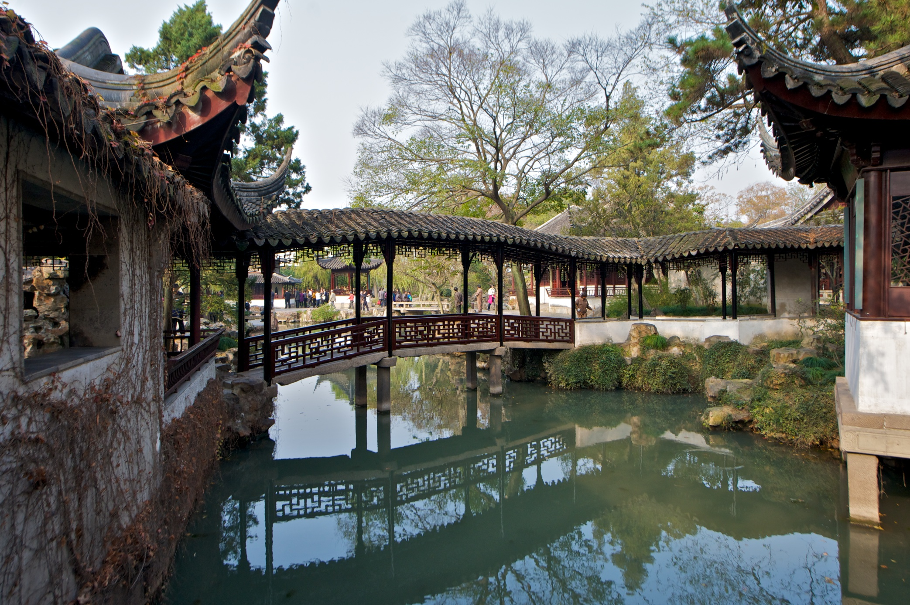

# Qinfang external references

Two of the site’s three required references are collected: the covered-bridge silhouette and Shaw night-exterior lighting. The specified Come Drink With Me bridge-pavilion frame remains open.

**Flying Rainbow Bridge**, Kevin A. McGill (kevinmcgill), 25 November 2011. [Source and attribution](https://commons.wikimedia.org/wiki/File:Flying_Rainbow_Bridge_(6399173931).jpg), [original Flickr photo](https://www.flickr.com/photos/kevinamcgill/6399173931/), [CC BY-SA 2.0](https://creativecommons.org/licenses/by-sa/2.0/). This is an unmodified original copy.

The covered crossing provides a silhouette reference: a low tiled roof, repeated timber posts and railings, white banks and a clear reflection below. It is not a texture or production game asset. The current garden keeps its original architecture and requires its own composition review.

The specified *Come Drink With Me* bridge-pavilion still remains uncollected. The night-set lighting frame is recorded below.

Candidate review on 2026-10-07: the [Kaohsiung Film Archive April 2018 catalogue](https://kfa.kcg.gov.tw/files/20230606144635950.pdf) was downloaded and its cover and printed page 15 (PDF page 16) rendered and inspected. The cover uses an isolated fighter on red festival artwork; page 15 shows a daylight courtyard fight. Neither shows the specified bridge pavilion. The two stills in the [Celestial Pictures Magic Blade article](https://www.shawbrothersuniverse.com/bring-out-devil-grandma-the-absurdity-of-style-in-the-magic-blade) show a forest fight and a daylight forest close-up. Neither supplies the requested night-set lighting or rockery cave. These candidates are rejected for those slots and do not increase the collected-reference count. The catalogue remains temporary inspection material, separate from the licensed photo collected here.

## Collected night-set lighting reference — 2026-10-08

**The Magic Blade**, frame at 53.0 seconds in the [Shaw Brothers Clips trailer](https://www.youtube.com/watch?v=FU-5zusTJSY), uploaded 20140703. The individual frame photographer and capture date are not supplied. This is copyrighted reference material; no open licence is asserted. It is outside shipped game assets.

A low-key terrace exterior has a warm round lamp at the left, cool blue light at the right, near-black sky and roof/figure silhouettes, and a broad central area that remains unlit. This fills the specified Shaw night-exterior lighting reference: limited cool wash, localized warm practical and dark space between. Night appearance is visually inferred. It does not identify Qinfang or show the four-exit Come Drink With Me bridge pavilion, and it provides no measured colors, light-linking configuration or lamp energy. Use the contrast pattern while reducing the green contribution as the user requested.

Original downloaded stream and exact extraction provenance are retained in [the shared trailer archive](../supporting/shaw-trailers/README.md). The 600 × 480 decoded frame retains publisher framing, bars and subtitles, with no crop, resize or added color grade. SHA-256: `2e64bb8ab949c47a3077aa9c8d6b669c68081de31c8716bdd8c1afa0012cc4b4`.
