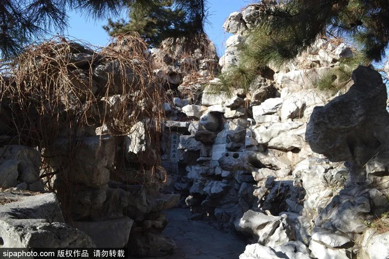

# Rockery gate external references

One of three required references is collected: slot 1, the rockery in the Beijing Daguanyuan reconstruction.

**北京大观园 曲径通幽**, Sipa Photo image published by Beijing Tourism on 2021-02-25. [Primary article and attribution](https://www.visitbeijing.com.cn/article/47Qkj2HWV4x). The individual photographer and capture date are not supplied. The article credits 怡格格 for text and 邢爽 as editor; neither is identified as the photographer. Original bytes and the Sipa watermark are retained. This is copyrighted reference material, with no open licence asserted, and is not a shipped game asset.

The directly reviewed image shows the narrow dry paved path, irregular rock piles and overhangs, dark gaps, vines and pine branches. It supports the obstructed sightline and organic surface treatment. Daylight and the limited frame do not establish the full route, two bends, dimensions, plaster construction, fog or lantern lighting.

A second article image shows an overhang above a pool with lotus. It was reviewed but is not counted as another slot. The required *The Magic Blade* cave corridor and dark-side moon gate in fog remain missing.
