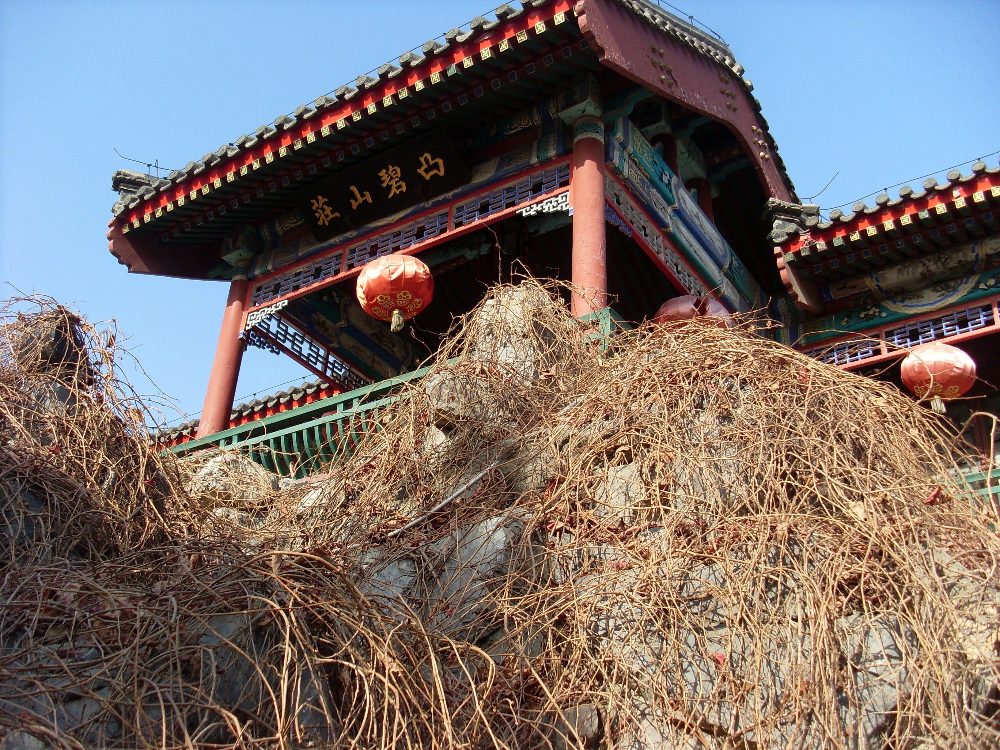
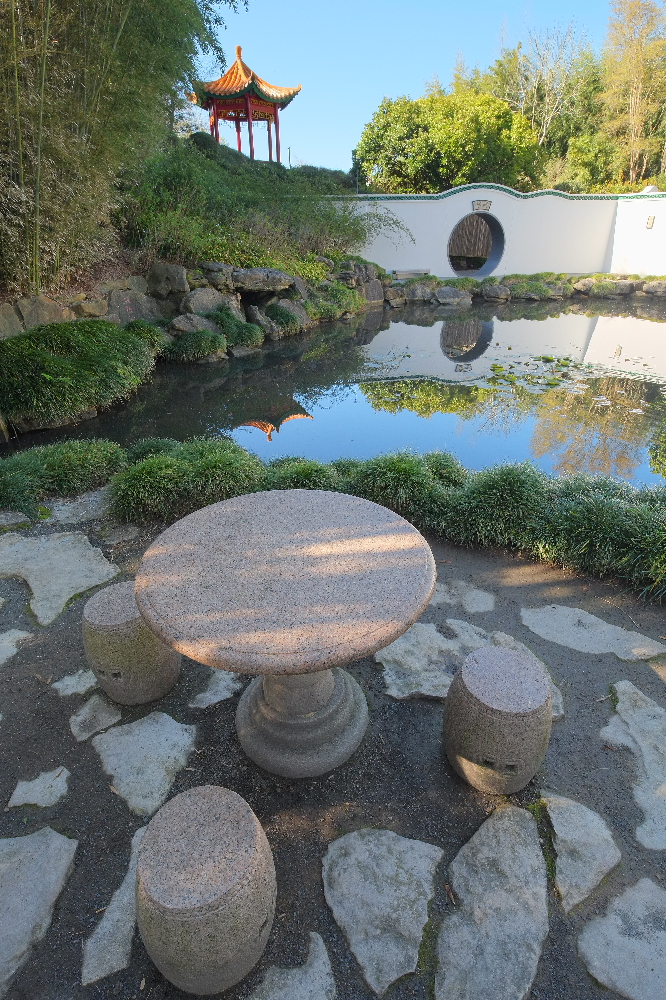

# Tubi Tang external references

All three required references are collected: hilltop architecture, a close foreground stone table surface and a Shaw night-set lighting frame.

**Aobishanzhuang, Daguanyuan.jpg**, 刻意, 2010-12-20. [Source and attribution](https://commons.wikimedia.org/wiki/File:Aobishanzhuang,_Daguanyuan.jpg), [CC BY-SA 3.0](https://creativecommons.org/licenses/by-sa/3.0). Unmodified original; bytes verified against the Commons SHA-1.

An elevated hall on a rocky rise, with thick red columns, a continuous gray tiled eave, painted blue-green brackets, pierced geometric lintel screens, a low green balustrade and hanging lanterns. The visible plaque reads 凸碧山莊. Useful for hilltop frontage, stock construction and roof/rail proportions; this close upward view does not establish terrace height, stair geometry or the required night lighting.

The Shaw Brothers night-set frame is recorded below. Neither daylight photograph fills that slot.

## Stone topic table material

**Pavilion and moon gate reflecting in pond in Chinese Scholars' Garden.jpg**, Pseudopanax at English Wikipedia, 2022-09-25. [Source and attribution](https://commons.wikimedia.org/wiki/File:Pavilion_and_moon_gate_reflecting_in_pond_in_Chinese_Scholars%27_Garden.jpg), [author public-domain release](https://commons.wikimedia.org/wiki/File:Pavilion_and_moon_gate_reflecting_in_pond_in_Chinese_Scholars%27_Garden.jpg#Licensing). Unmodified original; bytes verified against the Commons SHA-1. No CC0 licence is substituted for the author release.

Direct original review shows a close foreground pink-gray stone tabletop with dense dark grains, a rounded thick edge, a shallow concentric perimeter groove and a dull surface. Matching cylindrical stools show a rougher side finish; the pedestal has broad turned transitions. Useful for the hilltop stone topic table surface and edge treatment. The garden is Hamilton Gardens in New Zealand, not Tubi; the distant pavilion/moon gate does not identify the site. Daylight color and photographic grain are observation references, not the nighttime palette or a shipped scan.

## Collected night-set lighting reference — 2026-10-08

**The Enchanting Shadow**, frame at 3.0 seconds in the [Shaw Brothers Clips trailer](https://www.youtube.com/watch?v=oJ_Sy5j1XYU), uploaded 20121018. The individual frame photographer and capture date are not supplied. This is copyrighted reference material; no open licence is asserted. It is outside shipped game assets.

A tiered pagoda-like upright form is illuminated blue through a dark mesh of branches, with near-black surroundings and small warm/red detail. Night appearance is visually inferred. It demonstrates separating an elevated architectural silhouette from foreground foliage with a restricted cool wash while retaining darkness. This fills the generic Shaw night-set lighting slot, not Tubi identity, hill height, stair count, terrace dimensions or the required stone table. It is not a source model or a detailed construction photograph.

Original downloaded stream and exact extraction provenance are retained in [the shared trailer archive](../supporting/shaw-trailers/README.md). The 600 × 480 decoded frame retains publisher framing, bars and subtitles, with no crop, resize or added color grade. SHA-256: `3ca8bdff92712dd03a4bb907397246042ebd58e08e4a1d02c450dfb6b02c33c2`.

The trailer labels the film 1959; the saved Hong Kong Film Archive record gives 1960. The discrepancy is recorded without treating the channel year as verified.
