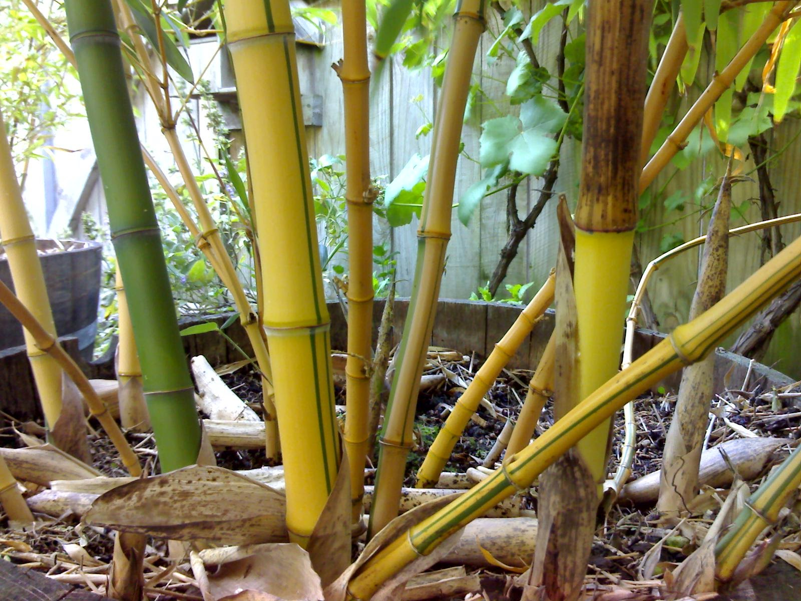

# Xiaoxiang Guan external references

Two of three required references are collected: bamboo stems and the identified Xiaoxiang entrance.

**Phyllostachys vivax f aureocaulis.jpg**, Franzo, 24 December 2007. [Source and attribution](https://commons.wikimedia.org/wiki/File:Phyllostachys_vivax_f_aureocaulis.jpg), [CC0 1.0](https://creativecommons.org/publicdomain/zero/1.0/deed.en). Unmodified original; bytes verified against the Commons SHA-1.

Close culms show raised joint rings, smooth internodes, narrow longitudinal stripes, branching at nodes and curled papery sheaths around new shoots. Useful for stem construction and surface variation. This cultivar has yellow and green stems; its colors do not prescribe the court palette. The close view does not establish mature clump height, leaf density or night lighting.

The bamboo photograph fills the close foliage/material slot. The entrance photograph below fills the architecture slot. The sourced night-set still remains uncollected.

## Collected architecture reference — 2026-10-08

xiaoxiang-entrance-plaque.jpg — photograph by 朱華龍 - Zhu Hua Long, 2016-02-16 10:22. [Source](https://commons.wikimedia.org/wiki/File:%E5%A4%A7%E8%A7%82%E5%9B%AD_Beijing,_China_(26011604866).jpg), [Flickr original](https://www.flickr.com/photos/mfaris01/26011604866/), [CC BY 2.0](https://creativecommons.org/licenses/by/2.0). Original bytes retained. SHA-256: `0e07426f3e922afe58f1d2ff012a53e645e2a1782b69aa34eaab304c5bca1ec3`.

The visible plaque reads 瀟湘館 from right to left, identifying Xiaoxiang Guan. Green door leaves, red columns, blue/green/gold beam painting, narrow geometric transom lattice, painted plant panels and a bamboo view through the doorway supply site-specific entrance and woodwork details. This cropped daylight photograph does not establish the whole bamboo court, measured dimensions, roof layout or night lighting.
