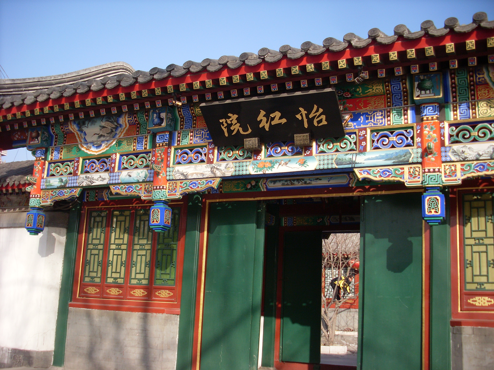
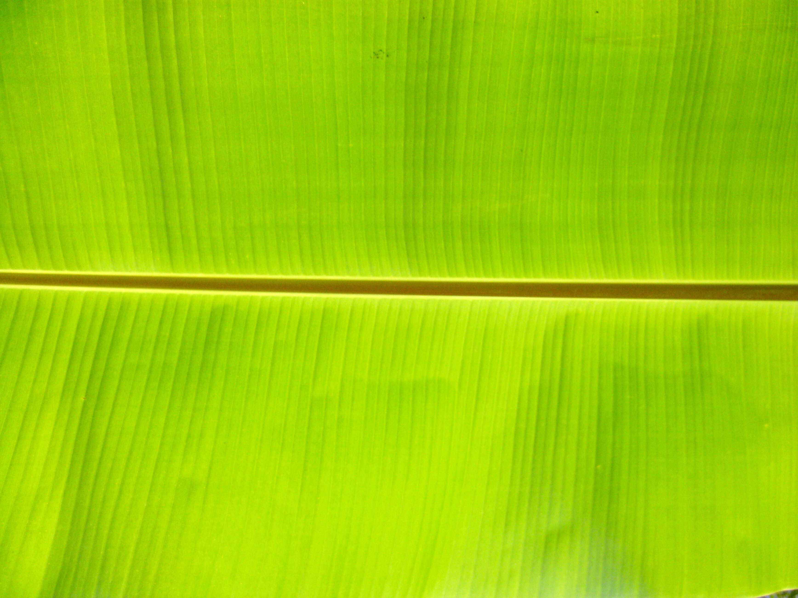

# Yihong Yuan external references

All three required reference slots are collected: courtyard night-set lighting, architecture and a banana-leaf surface close-up.

**Yihongyuan, Daguanyuan**, 刻意, 20 December 2010. [Source and attribution](https://commons.wikimedia.org/wiki/File:Yihongyuan,_Daguanyuan.jpg), [CC BY-SA 3.0](https://creativecommons.org/licenses/by-sa/3.0/). Unmodified original; bytes verified against the Commons SHA-1.

Lacquered entry beneath grey tiled eaves, paired doors and flank lattice windows, a dark gold-lettered plaque and densely painted blue/red/green bracket panels. Architecture reference only; not a night-lighting reference.

Daylight references do not establish the night treatment.

**Banana leaf close up**, Hysocc, 26 February 2008. [Source and attribution](https://commons.wikimedia.org/wiki/File:Banana_leaf_close_up.jpg), [CC BY-SA 3.0](https://creativecommons.org/licenses/by-sa/3.0/). Unmodified original, verified against the published Commons SHA-1.

A raised central rib, dense parallel lateral veins, fine longitudinal ridges and a slightly undulating blade surface inform the courtyard's banana foliage. The backlit daylight green is not the intended night palette. This close-up does not establish the complete plant silhouette or torn margins and is not used as a game texture.

***The Magic Blade* (1976)**, motion-picture still credited to Celestial Pictures Ltd., in the Hong Kong Film Archive's *When the Wind Was Blowing Wild*, PDF page 136 / printed page 134. [Primary publication](https://www.filmarchive.gov.hk/documents/18995340/19057029/Oral%2BHistory%2BSeries_eng07_ebook.pdf). The individual still photographer is uncredited. Both publication and still are copyrighted; no open licence is asserted. The original encoded JPX image stream and complete source PDF are retained, with no cropped or recolored reference.

The directly reviewed page shows a pale courtyard wall and repeated curved tiled gates against black sky/tree masses, with hard blue-violet light and warm skin/red costume accents. This guides the contrast of Yihong's whitewash and dark timber after the reduced-green revision. Night appearance is a visual inference; the caption identifies the film but not the scene time. There is no visible warm lantern or window, so the amber-window treatment needs separate art verification. This is a lighting reference, not surveyed Yihong geometry, a Magic Blade cave still, or a shipped game asset.
