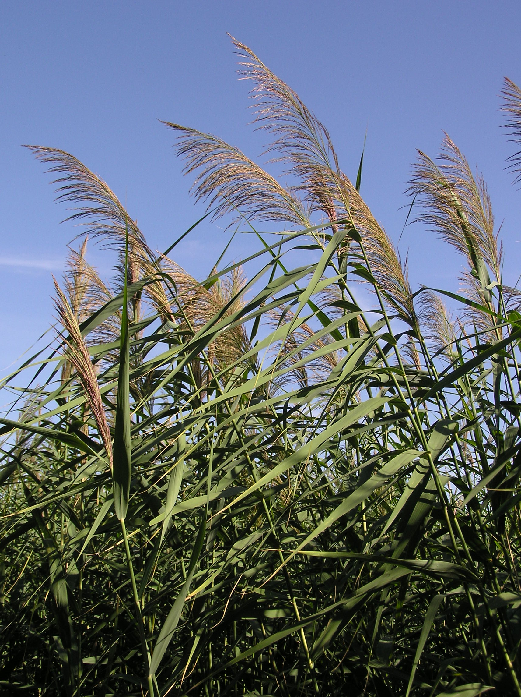

# Ziling Zhou external references

All three required references are collected: reed foliage, the identified modern entrance and a Shaw night-set lighting frame.

**Phragmites australis (inflorescences).jpg**, Le.Loup.Gris, 2011-08-26. [Source and attribution](https://commons.wikimedia.org/wiki/File:Phragmites_australis_(inflorescences).jpg), [CC BY-SA 3.0](https://creativecommons.org/licenses/by-sa/3.0). Unmodified original; bytes verified against the Commons SHA-1.

Tall jointed stems, long narrow drooping leaves and fine tawny-purple branching plumes, with varied angles and clear gaps between stems. Useful for reed silhouette and plume/leaf density; the daylight sky and lighting are not the scene palette.

The reed photo fills slot 3; the entrance photo below fills slot 2. The Shaw Brothers night-set frame is recorded below.

## Collected entrance architecture reference — 2026-10-08

ziling-entrance-plaque.jpg — 朱華龍 - Zhu Hua Long, 2016-02-16 11:55. [Source](https://commons.wikimedia.org/wiki/File:%E5%A4%A7%E8%A7%82%E5%9B%AD_Beijing,_China_(25931034492).jpg), [photographer original](https://www.flickr.com/photos/mfaris01/25931034492/), [CC BY 2.0](https://creativecommons.org/licenses/by/2.0). Original bytes retained; SHA-256 `70865d60cc8161b839c808f4397982f646fb3b1d0d1d7a44e4000b54abb96552`.

The visible plaque reads 紫菱洲 from right to left, identifying the modern Ziling entrance. Paired red timber doors, a gray barrel-tile eave, painted crossbeams and white plaster side walls supply site-specific entrance construction. This photo does not show the island, reeds, landing or footbridge and does not prescribe replacing the project's low island with a gatehouse. Island/bridge composition and night lighting still need separate art review.

Architecture, close material and sourced Shaw night-set slots are collected. Final scene art acceptance remains open.

## Collected night-set lighting reference — 2026-10-08

**The Enchanting Shadow**, frame at 11.0 seconds in the [Shaw Brothers Clips trailer](https://www.youtube.com/watch?v=oJ_Sy5j1XYU), uploaded 20121018. The individual frame photographer and capture date are not supplied. This is copyrighted reference material; no open licence is asserted. It is outside shipped game assets.

A ruined brick opening and sparse table/bench dressing are framed by dark foliage; blue-lit leaves and masonry edges sit beside a warmer lit figure. Large black gaps keep the foreground sparse and layered. Night appearance is visually inferred from the dark exterior and directed cool/warm treatment. This guides generic night foliage and built-set composition, not Ziling identity, reed species, island geometry, waterline or footbridge construction. The separate close reed reference supplies botanical form; the saturated source blue is qualitative lighting guidance.

Original downloaded stream and exact extraction provenance are retained in [the shared trailer archive](../supporting/shaw-trailers/README.md). The 600 × 480 decoded frame retains publisher framing, bars and subtitles, with no crop, resize or added color grade. SHA-256: `6835fb63c3df14e0905ec2784c12f26154543add44fff01058a61b7cc93458c7`.

The trailer labels the film 1959; the saved Hong Kong Film Archive record gives 1960. The discrepancy is recorded without treating the channel year as verified.
